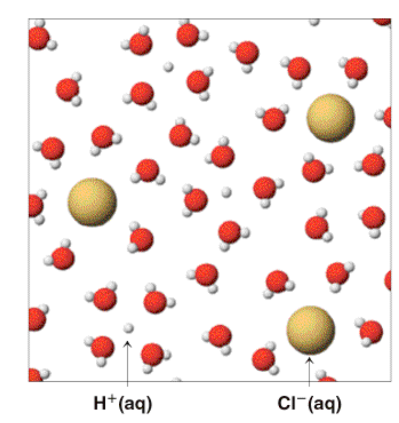
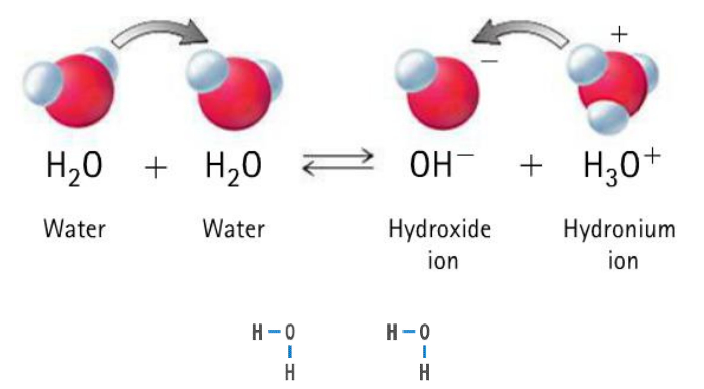
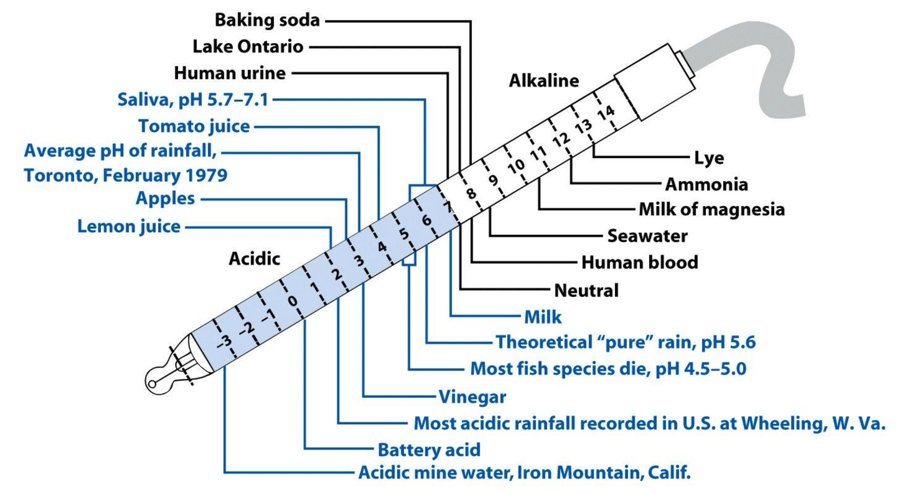
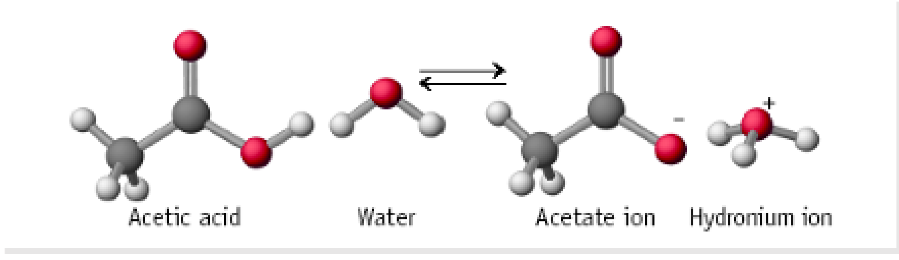

# Demo Case: CHEM1020 2026 Acids and Bases -- With Answers-1

- Study Guide ID: `1014137`
- Deck ID: `1744101`
- Platform: `web`
- Generated images: **4**
- User identity: **Anonymized real user**

---

# Acid–Base Roles and Definitions

## Acid–base importance and definitions

- **Natural occurrence:** Many substances can behave as acids or bases.
- **Environmental pH:** Lakes, rivers, oceans, and rain depend on dissolved acids/bases.
  - **Ocean carbon:** $\mathrm{CO_2}$ solubility affects the global carbon budget.
- **Biological relevance:** Amino acids contain both acidic and basic groups.
  - **Peptide formation:** Acid–base functional groups participate in bond-forming reactions.
- **Body pH control:** Gastric acid is mainly $\mathrm{HCl}$ with pH $1$–$2$.
- **Blood pH range:** Normal blood pH is $7.35$–$7.45$.
  - **Fatal deviation:** Changes outside this narrow range can be lethal.
- **Everyday examples:** Acids/bases occur in citrus fruit, formic acid, caffeine, aspirin, amino acids, and sulfuric acid.

| Definition | Acid | Base |
|---|---|---|
| Arrhenius | Increases $\mathrm{H^+}$ in aqueous solution | Increases $\mathrm{OH^-}$ in aqueous solution |
| Brønsted–Lowry | Proton donor | Proton acceptor |
| Lewis | Electron-pair acceptor | Electron-pair donor |

- **Acid meaning:** Acid derives from Latin *acidus*, meaning sour.
- **Acidic solution:** pH $<7$; litmus paper turns red.
- **Nitric acid example:** $\mathrm{HNO_3(aq) \rightarrow H^+(aq)+NO_3^-(aq)}$.
- **Ammonium acid example:** $\mathrm{NH_4^+(aq) \rightleftharpoons H^+(aq)+NH_3(aq)}$.
- **Monoprotic acids:** Donate one $\mathrm{H^+}$ ion.
  - **Examples:** $\mathrm{HF}$, $\mathrm{HCN}$, $\mathrm{HCl}$, $\mathrm{HBr}$, $\mathrm{HNO_3}$.
- **Polyprotic acids:** Donate multiple $\mathrm{H^+}$ ions.
  - **Examples:** $\mathrm{H_2SO_4}$, $\mathrm{H_2CO_3}$, $\mathrm{H_2S}$, $\mathrm{H_3PO_4}$.

## Bases and conjugate pairs

- **Neutralisation pattern:** Acid + base $\rightarrow$ salt + water.
- **Base behaviour:** Bases neutralise acids and form basic solutions.
- **Basic solution:** pH $>7$; litmus paper turns blue.
- **Carbonate example:** $\mathrm{CO_3^{2-}(aq)+H_2O(l)\rightleftharpoons HCO_3^-(aq)+OH^-(aq)}$.
- **Ammonia example:** $\mathrm{NH_3(aq)+H_2O(l)\rightleftharpoons NH_4^+(aq)+OH^-(aq)}$.
- **Proton transfer:** Acid–base transfer is an equilibrium process.
- **Conjugate pair:** An acid leaves a base able to accept $\mathrm{H^+}$.
- **Brønsted–Lowry reaction:** Always involves $\mathrm{H^+}$ transfer and two conjugate pairs.

| Reaction component | Left side | Right side |
|---|---|---|
| Acid pair | $\mathrm{HF}$ | $\mathrm{F^-}$ |
| Base pair | $\mathrm{NH_3}$ | $\mathrm{NH_4^+}$ |

- **Example transfer:** $\mathrm{HF}$ donates a proton to $\mathrm{NH_3}$.
- **Conjugate pairs:** $\mathrm{HF/F^-}$ and $\mathrm{NH_4^+/NH_3}$.
- **Practice result:** For $\mathrm{HF+H_2O\rightleftharpoons H_3O^+ + F^-}$, correct statement is C.
  - **Acid assignment:** $\mathrm{HF}$ is the acid.
  - **Conjugate base:** $\mathrm{F^-}$ is its conjugate base.
  - **Water role:** $\mathrm{H_2O}$ accepts a proton.
  - **Hydronium role:** $\mathrm{H_3O^+}$ is water’s conjugate acid.

# Acid and Base Strength

## Strength constants and strong species

- **Strong acids:** Almost completely dissociate to ions in water.
  - **Strong acid concentration:** $[\mathrm{H^+}]=[\text{acid}]$.
- **Strong bases:** Almost completely produce hydroxide in water.
  - **Strong base concentration:** $[\mathrm{OH^-}]=[\text{base}]$.
- **Weak acids:** Partially dissociate in solution.
  - **Weak acid concentration:** $[\mathrm{H^+}]\ll[\text{acid}]$.
- **Weak bases:** Partially form hydroxide in solution.
  - **Weak base concentration:** $[\mathrm{OH^-}]\ll[\text{base}]$.
- **Acid constant:** For $\mathrm{HA+H_2O\rightleftharpoons H^+ + A^-}$,
  $$K_a=\frac{[\mathrm{H^+}][\mathrm{A^-}]}{[\mathrm{HA}]}$$
- **Base constant:** For $\mathrm{B+H_2O\rightleftharpoons BH^+ + OH^-}$,
  $$K_b=\frac{[\mathrm{BH^+}][\mathrm{OH^-}]}{[\mathrm{B}]}$$
- **Strong species constants:** Strong acids have large $K_a$; strong bases have large $K_b$.
- **Large constant:** “Large” means much greater than $1$.

| Strong acids | Name |
|---|---|
| $\mathrm{HCl}$ | Hydrochloric acid |
| $\mathrm{HBr}$ | Hydrobromic acid |
| $\mathrm{HI}$ | Hydroiodic acid |
| $\mathrm{H_2SO_4}$ | Sulfuric acid |
| $\mathrm{HNO_3}$ | Nitric acid |
| $\mathrm{HClO_4}$ | Perchloric acid |

| Strong bases | Name |
|---|---|
| $\mathrm{LiOH}$ | Lithium hydroxide |
| $\mathrm{NaOH}$ | Sodium hydroxide |
| $\mathrm{KOH}$ | Potassium hydroxide |
| $\mathrm{RbOH}$ | Rubidium hydroxide |
| $\mathrm{CsOH}$ | Cesium hydroxide |
| $\mathrm{R_4NOH}$ | Quaternary ammonium hydroxide |

- **Sulfuric acid caveat:** Only first proton ionisation is complete.
- **Second sulfuric ionisation:** Has equilibrium constant about $10\times10^{-2}$.
- **Quaternary ammonium base:** General hydroxide salt of ammonium cation with four organic groups.

## Weak constants and equilibrium direction

| Weak acid | $K_a$ | Weak base | $K_b$ |
|---|---:|---|---:|
| $\mathrm{H_3PO_4}$ | $7.5\times10^{-3}$ | $\mathrm{CN^-}$ | $2.5\times10^{-5}$ |
| $\mathrm{HF}$ | $7.4\times10^{-4}$ | $\mathrm{NH_3}$ | $1.8\times10^{-5}$ |
| $\mathrm{CH_3COOH}$ | $6.3\times10^{-5}$ | $\mathrm{HCO_3^-}$ | $2.4\times10^{-8}$ |
| $\mathrm{H_2CO_3}$ | $4.2\times10^{-7}$ | $\mathrm{CH_3COO^-}$ | $5.6\times10^{-10}$ |
| $\mathrm{NH_4^+}$ | $5.6\times10^{-10}$ | $\mathrm{F^-}$ | $1.4\times10^{-11}$ |
| $\mathrm{HCN}$ | $4.0\times10^{-10}$ | $\mathrm{H_2PO_4^-}$ | $1.3\times10^{-12}$ |

- **Weak constants:** Weak acids and bases have $K_a$ or $K_b \ll 1$.
- **Conjugate trend:** Stronger acid/base gives weaker conjugate species.
- **General equilibrium:** acid + base $\rightleftharpoons$ conjugate base + conjugate acid.
- **Equilibrium preference:** Depends on relative acid/base strengths.
- **Strong acid effect:** Excellent proton donor; conjugate base is very weak.
- **Weak acid effect:** Does not donate all protons; conjugate base is weak.
- **Strong base effect:** Readily accepts proton; conjugate acid is very weak.
- **Weak base effect:** Less likely to accept proton; conjugate acid is weak.
- **Reaction direction:** Proton transfer proceeds from stronger pair to weaker pair.
- **Strong acid schematic:** $\mathrm{HCl}$ fully dissociates; high $K_a$.
- **Weak acid schematic:** $\mathrm{CH_3COOH}$ partly dissociates; low $K_a$.
- **Concentration comparison:** Same acid concentration can produce different ionisation extents.

# Water, Hydronium, and $K_w$

## Hydronium formation and water autoprotolysis

- **Free protons:** $\mathrm{H^+}$ does not exist independently in water.
- **Amphiprotic water:** Water can donate or accept a proton.
- **Hydronium formation:** Protons combine with water to form $\mathrm{H_3O^+}$.
- **Hydrated hydronium:** $\mathrm{H_3O^+}$ is strongly hydrated.
- **Autoprotolysis reaction:** Two water molecules exchange a proton.
  $$\mathrm{H_2O+H_2O\rightleftharpoons OH^-+H_3O^+}$$
- **Aqueous equilibrium:** This equilibrium exists in all aqueous solutions.
- **Alternative expression:** $\mathrm{H_2O\rightleftharpoons H^+ + OH^-}$ may also be used.
- **Ionisation constant:** $K_w$ is also called autoionisation or autoprotolysis constant.
- **Water expression:** 
  $$K_w=\frac{[\mathrm{OH^-}][\mathrm{H_3O^+}]}{[\mathrm{H_2O}][\mathrm{H_2O}]}
  =[\mathrm{OH^-}][\mathrm{H_3O^+}]$$
- **Alternative expression:** 
  $$K_w=\frac{[\mathrm{OH^-}][\mathrm{H^+}]}{[\mathrm{H_2O}]}
  =[\mathrm{OH^-}][\mathrm{H^+}]$$
- **Equilibrium constants:** Strictly use activities, not raw concentrations.
- **Solution approximation:** Activities are approximated by molar concentrations.
- **Dimensionless constants:** Concentrations are divided by standard state $1.00\ \mathrm{M}$.
- **Pure water activity:** Pure $\mathrm{H_2O}$ has activity $1$.
- **Dilute solution view:** $[\mathrm{H_2O}]$ is effectively constant at $55.5\ \mathrm{M}$.

## Numerical value and acid–base equilibrium

- **Pure water ions:** Only $\mathrm{H_3O^+}$ and $\mathrm{OH^-}$ are present.
- **Neutral equality:** In pure water, $[\mathrm{H_3O^+}]=[\mathrm{OH^-}]$.
- **Conductivity use:** Conductivity measurements determine these ion concentrations.
- **25°C ion concentration:** Each ion has concentration $10^{-7}\ \mathrm{M}$.
- **25°C $K_w$ value:** 
  $$K_w=[\mathrm{OH^-}][\mathrm{H_3O^+}]=10^{-7}\times10^{-7}=10^{-14}$$
- **Temperature dependence:** $K_w$ varies with temperature.

| Temperature °C | $K_w$ |
|---:|---:|
| 0 | $1.14\times10^{-15}$ |
| 25 | $1.00\times10^{-14}$ |
| 35 | $2.09\times10^{-14}$ |
| 40 | $2.92\times10^{-14}$ |
| 50 | $5.47\times10^{-14}$ |

- **Neutral solution:** $[\mathrm{OH^-}]=[\mathrm{H_3O^+}]=10^{-7}\ \mathrm{M}$.
- **Acidic solution:** $[\mathrm{H_3O^+}]>10^{-7}\ \mathrm{M}$ while $K_w$ still holds.
  - **Example:** If $[\mathrm{H_3O^+}]=0.1\ \mathrm{M}$, then $[\mathrm{OH^-}]=10^{-13}\ \mathrm{M}$.
- **Basic solution:** $[\mathrm{OH^-}]>10^{-7}\ \mathrm{M}$ while $K_w$ still holds.
  - **Example:** If $[\mathrm{OH^-}]=0.01\ \mathrm{M}$, then $[\mathrm{H_3O^+}]=10^{-12}\ \mathrm{M}$.
- **Conjugate relation:** For an acid and conjugate base:
  $$K_w=K_aK_b=10^{-14}$$
- **Inverse trend:** As $K_a$ increases, $K_b$ decreases.
- **Table implication:** Most tables report only $K_a$.
- **pH use:** $K_a$, $K_b$, and $K_w$ allow pH prediction from limited data.
- **HCN example:** Combining acid and base reactions gives water autoprotolysis.
  - **Given constants:** $\mathrm{HCN}$ has $K_a=4.0\times10^{-10}$; $\mathrm{CN^-}$ has $K_b=2.5\times10^{-5}$.
  - **Product relation:** $K_aK_b=[\mathrm{H_3O^+}][\mathrm{OH^-}]=K_w$.

# pH, pOH, and Log Constants

## pH and pOH scales

- **General p-function:** $\mathrm{p(anything)}=-\log(\mathrm{anything})$.
- **pH definition:** $\mathrm{pH}=-\log([\mathrm{H^+}])$.
- **pOH definition:** $\mathrm{pOH}=-\log([\mathrm{OH^-}])$.
- **Acidic pH:** pH $<7$.
- **Basic pH:** pH $>7$.
- **Neutral pH:** pH $=7$.
- **pKw definition:** $\mathrm{p}K_w=-\log(K_w)$.
- **25°C relation:** Since $K_w=[\mathrm{H_3O^+}][\mathrm{OH^-}]=10^{-14}$,
  $$\mathrm{p}K_w=\mathrm{pH}+\mathrm{pOH}=14$$
- **pH–pOH sum:** At $25^\circ\mathrm{C}$, aqueous solutions satisfy $\mathrm{pH+pOH}=14$.
- **Practice method:** If pOH $=11.30$, then pH $=14-11.30=2.70$.
- **Hydrogen concentration:** $[\mathrm{H^+}]=10^{-2.7}=2.0\times10^{-3}\ \mathrm{M}$.
- **Practice answer:** Correct choice is A.

## pKa, pKb, and strong-solution calculations

- **Conjugate product:** For a conjugate acid–base pair, $K_aK_b=K_w$.
- **pKa definition:** $\mathrm{p}K_a=-\log(K_a)$.
- **pKb definition:** $\mathrm{p}K_b=-\log(K_b)$.
- **25°C p-relation:** 
  $$\mathrm{p}K_a+\mathrm{p}K_b=\mathrm{p}K_w=14$$
- **Strong base example:** $0.700\ \mathrm{g}$ NaOH in $485\ \mathrm{mL}$ water.
  - **Molar mass:** $\mathrm{MW(NaOH)}=39.997\ \mathrm{g\ mol^{-1}}$.
  - **Moles NaOH:** $0.700/39.997=0.0175\ \mathrm{mol}$.
  - **NaOH concentration:** $0.0175/0.485=0.0361\ \mathrm{M}$.
  - **Strong base assumption:** $[\mathrm{OH^-}]=[\mathrm{NaOH}]=0.0361\ \mathrm{M}$.
  - **pOH result:** $\mathrm{pOH}=-\log(0.0361)=1.44$.
  - **pH result:** $\mathrm{pH}=14-1.44=12.6$.
- **Alternative strong-base path:** $[\mathrm{H_3O^+}]=10^{-14}/0.0361=2.77\times10^{-13}\ \mathrm{M}$.
- **Alkaline conclusion:** Calculated pH $12.6$ matches a basic solution.
- **Strong acid practice:** $\mathrm{HCl}$ at $4\times10^{-4}\ \mathrm{M}$ fully ionises.
- **HCl pH:** $[\mathrm{H_3O^+}]=4\times10^{-4}\ \mathrm{M}$.
- **Practice answer:** $\mathrm{pH}=-\log(4\times10^{-4})=3.40$, choice D.

# Weak Acid and Weak Base Calculations

## Weak acid and base pH setup

- **Weak solution requirement:** Use the relevant equilibrium constant.
- **Benzoic acid example:** Calculate pH of $0.20\ \mathrm{M}$ $\mathrm{C_6H_5COOH}$.
- **Given constant:** $K_a=6.3\times10^{-5}$.
- **Dissociation reaction:** 
  $$\mathrm{C_6H_5COOH+H_2O\rightleftharpoons H_3O^+ + C_6H_5COO^-}$$
- **Equilibrium expression:** 
  $$K_a=\frac{[\mathrm{H_3O^+}][\mathrm{C_6H_5COO^-}]}{[\mathrm{C_6H_5COOH}]}$$
- **Extent variable:** Let $x$ be acid concentration that dissociates.
- **Equilibrium concentrations:** $[\mathrm{H_3O^+}]=[\mathrm{C_6H_5COO^-}]=x$ and $[\mathrm{C_6H_5COOH}]=0.20-x$.
- **Approximation setup:** $6.2\times10^{-5}=x^2/(0.20-x)$.
- **Small-$K_a$ approximation:** Since $K_a$ is small, $x$ is small.
- **Approximate result:** $x=0.0035\ \mathrm{M}$.
- **Benzoic pH:** $\mathrm{pH}=-\log(0.0035)=2.45$.
- **Assumption check:** $0.20-0.0035=0.1964$, valid within about $2\%$.
- **Pyridine example:** $0.010\ \mathrm{M}$ pyridine with $K_b=1.5\times10^{-9}$.
- **Base reaction:** $\mathrm{C_5H_5N+H_2O\rightleftharpoons OH^- + C_5H_5NH^+}$.
- **Base expression:** 
  $$K_b=\frac{[\mathrm{C_5H_5NH^+}][\mathrm{OH^-}]}{[\mathrm{C_5H_5N}]}$$
- **Pyridine result:** $x=3.9\times10^{-6}$, pOH $=5.41$, pH $=8.59$.

## Quadratic need and approximation rule

- **General quadratic:** $ax^2+bx+c=0$.
- **Roots:** 
  $$x_\pm=\frac{-b\pm\sqrt{b^2-4ac}}{2a}$$
- **Weak acid/base form:** $a=1$, $b=K_a$, and $c=-K_aC$.
- **Initial concentration:** $C$ is the initial acid or base concentration.
- **Positive root:** Because $C$ and $K_a$ are positive, only $x_+$ is needed.
- **Approximation rule:** 
  $$x=\sqrt{K_aC}$$
  is generally valid if $C>400K_a$.
- **Accuracy statement:** Under this condition, pH should be accurate to $0.01$ units.
- **Formic acid example:** $0.001\ \mathrm{M}$ HCOOH with $K_a=1.8\times10^{-4}$.
- **Approximation failure:** $400K_a=0.072$, larger than initial concentration.
- **Quadratic equation:** $x^2+(1.8\times10^{-4})x-(1.8\times10^{-7})=0$.
- **Positive root only:** $x$ cannot be negative.
- **Formic result:** $x_+=3.4\times10^{-4}\ \mathrm{M}$.
- **Formic pH:** pH $=3.47$.
- **Remaining acid:** $[\mathrm{HCOOH}]=0.001-(3.4\times10^{-4})=6.6\times10^{-4}\ \mathrm{M}$.

## Calculating constants from pH

- **Reverse calculation:** Measured pH or $[\mathrm{H_3O^+}]$ can determine $K_a$, $K_b$, pKa, or pKb.
- **Lactic acid example:** $0.10\ \mathrm{M}$ lactic acid has pH $2.43$.
- **Lactic reaction:** 
  $$\mathrm{CH_3CH(OH)COOH+H_2O\rightleftharpoons CH_3CH(OH)COO^-+H_3O^+}$$
- **Hydronium from pH:** $[\mathrm{H_3O^+}]=10^{-2.43}=3.72\times10^{-3}\ \mathrm{M}$.
- **Conjugate base amount:** $[\mathrm{CH_3CH(OH)COO^-}]=3.72\times10^{-3}\ \mathrm{M}$.
- **Undissociated acid:** $[\mathrm{CH_3CH(OH)COOH}]=0.10-3.72\times10^{-3}$.
- **Lactic constant:** 
  $$K_a=\frac{(3.72\times10^{-3})^2}{0.10-(3.72\times10^{-3})}=1.4\times10^{-4}$$
- **Water autoionisation:** It also generates protons but is negligible here.
- **Unknown acid practice:** $0.02\ \mathrm{M}$ weak acid with pH $3.7$.
- **Hydronium value:** $[\mathrm{H_3O^+}]=10^{-3.7}=2\times10^{-4}\ \mathrm{M}$.
- **Unknown $K_a$:** 
  $$K_a=\frac{(2\times10^{-4})^2}{0.02-(2\times10^{-4})}=2\times10^{-6}$$
- **Unknown pKa:** $\mathrm{p}K_a=-\log(K_a)=5.7$.
- **Practice answer:** Correct choice is A.
- **Ethylamine practice:** $\mathrm{C_2H_5NH_2}$, $K_b=4.3\times10^{-4}$, concentration $0.25\ \mathrm{M}$.
- **Base reaction:** $\mathrm{C_2H_5NH_2+H_2O\rightleftharpoons C_2H_5NH_3^+ + OH^-}$.
- **Approximation:** $0.25-x\approx0.25$.
- **Hydroxide result:** $[\mathrm{OH^-}]=0.0104\ \mathrm{M}$.
- **Practice answer:** Approximate result is $1.0\times10^{-2}\ \mathrm{M}$, choice B.

# Common Ion Effect and Buffers

## Common ion effect

- **Common ion effect:** Ionisation is limited by added conjugate species.
- **Acid case:** Added conjugate base suppresses acid ionisation.
- **Acetic system:** Sodium acetate adds acetate to acetic acid solution.
- **Le Châtelier shift:** Added acetate pushes equilibrium left.
- **pH increase:** More acetic acid forms and $[\mathrm{H_3O^+}]$ decreases.
- **Sodium role:** Sodium ions do not affect pH.
- **Acetic acid alone:** For $0.25\ \mathrm{M}$ acetic acid with $K_a=1.8\times10^{-5}$:
  - **Equilibrium:** $\mathrm{CH_3COOH+H_2O\rightleftharpoons H_3O^+ + CH_3COO^-}$.
  - **Approximation valid:** $C\gg400K_a$.
  - **Hydronium result:** $x=2.1\times10^{-3}\ \mathrm{M}$.
  - **pH result:** pH $=2.67$.
- **Added acetate case:** Same solution made $0.10\ \mathrm{M}$ in sodium acetate.
- **Common-ion expression:** 
  $$1.8\times10^{-5}=\frac{[\mathrm{H_3O^+}]\times0.10}{0.25}$$
- **Buffered hydronium:** $[\mathrm{H_3O^+}]=4.5\times10^{-6}\ \mathrm{M}$.
- **Buffered pH:** pH $=4.35$.
- **Observed increase:** Adding conjugate base raises pH from about $2.96$ to $4.35$.

## Buffer action and capacity

- **Buffer definition:** Maintains relatively constant pH after acid or base addition.
- **Buffer composition:** Usually contains a conjugate acid–base pair.
- **Acid buffer pair:** Weak acid plus conjugate base.
- **Base buffer pair:** Weak base plus conjugate acid.
- **Maximum capacity:** Usually when acid and base concentrations are similar.
- **Acetate buffer contents:** Significant acetic acid and acetate ion are both present.
- **Added hydroxide:** $\mathrm{OH^-}$ reacts with undissociated acetic acid.
  - **Product formed:** Acetate ion plus water.
  - **pH effect:** $\mathrm{OH^-}$ is consumed, limiting pH change.
- **Added hydronium:** $\mathrm{H_3O^+}$ reacts with acetate ion.
  - **Product formed:** Acetic acid plus water.
  - **pH effect:** $\mathrm{H_3O^+}$ is consumed, limiting pH change.
- **Excess requirement:** Enough acid/base must remain to consume added $\mathrm{H_3O^+}$ or $\mathrm{OH^-}$.
- **Buffer capacity:** Limit to amount of acid or base a buffer can neutralise.
- **Capacity dependence:** Depends on concentrations of acid and conjugate base.
- **Higher concentration:** Gives higher buffer capacity.
- **Preparation range:** Buffers are usually prepared between $0.1\ \mathrm{M}$ and $1\ \mathrm{M}$.
- **Saliva example:** Saliva buffers neutralise harmful acids on teeth.
- **Acidic drinks:** Saliva buffer capacity is especially relevant for acidic drinks.