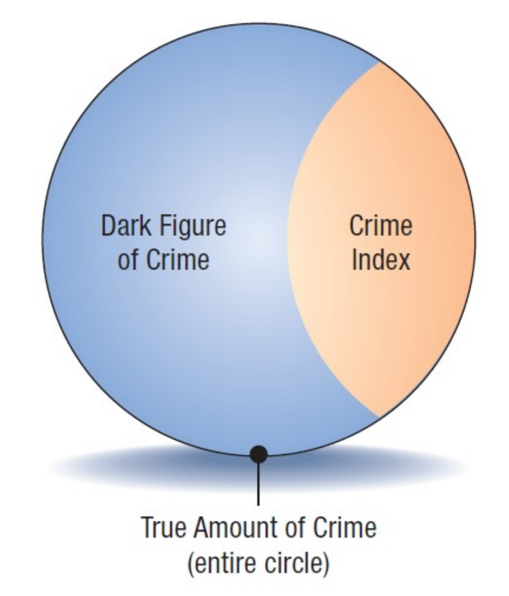
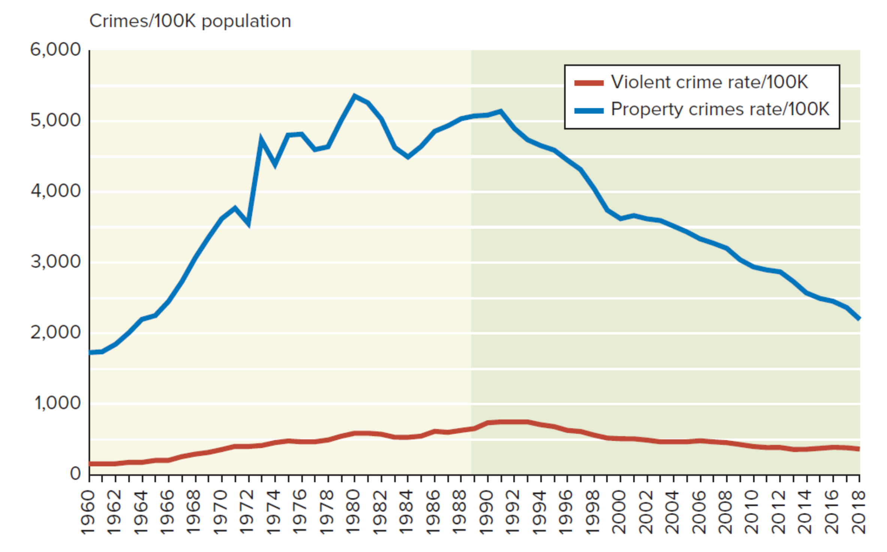

# Defining Crime

## Social and legal definitions
- **Definition problem:** Crime remains difficult to define consistently in criminal justice.
  - **Under-inclusion:** Some harmful behaviors are not legally treated as crimes.
  - **Over-inclusion:** Some less harmful behaviors are classified as crimes.
- **Social definition:** Crime is behavior violating society’s norms or social mores.
  - **Norms:** Standards about what people should think, say, or do.
  - **Group variation:** Norms differ across groups.
  - **Interpretation:** Norms are open to different meanings.
  - **Change over time:** Norms shift across time and place.
- **Legal definition:** Crime is an intentional penal-code violation without defense or excuse.
  - **State penalty:** The behavior must be punishable by the state.
  - **Main advantage:** Legal definitions are narrower and less ambiguous than social ones.

| Legal definition issue | Meaning | Examples or effects |
|---|---|---|
| Overcriminalization | Criminal law prohibits behaviors some argue should not be prohibited | Gambling; prostitution involving consenting adults; homosexual acts between consenting adults; some illegal drug use such as marijuana |
| Nonenforcement | Laws are not consistently enforced | Common for white-collar and government crimes; may create disrespect for law |
| Undercriminalization | Harmful actions or inactions are not criminalized | A corporation intentionally producing a potentially hazardous product to maximize profits |

# Elements of Crime and Criminal Responsibility

## Required elements of crime
- **Legal basis:** U.S. criminal justice relies on the legal definition of crime.
- **Complete crime:** Technically and ideally requires all listed elements.
  - **Harm:** External consequence needed to make conduct criminal.
  - **Legality:** Harm must be legally forbidden before the act.
  - **Actus reus:** Criminal conduct through action or inaction.
  - **Mens rea:** Criminal intent or guilty state of mind.
  - **Causation:** Conduct must directly cause the legally forbidden harm.
  - **Concurrence:** Criminal act and criminal intent must occur together.
  - **Punishment:** Statutory punishment or threat of punishment must exist.
- **Harm requirement:** Crime requires physical or verbal harm.
  - **Mere thought:** Thinking about crime is not a crime.
  - **Verbal threat:** Threatening to strike another person can be criminal.
- **Legality requirement:** Law must not operate retroactively.
  - **Ex post facto law:** Criminalizes an act after it occurred.
  - **Punishment increase:** Raises punishment after the crime was committed.
  - **Evidence-rule change:** Alters evidence rules after the crime occurred.
- **Actus reus:** Includes intentional or reckless actions and omissions causing harm.
  - **Inaction:** Crimes can involve what people fail to do.
- **Causation:** The actus reus must directly lead to harm.
  - **Timing:** Harm must occur without a long delay.
- **Concurrence:** Actus reus and mens rea must align.
  - **Simultaneity:** Conduct and intent must occur together.
- **Punishment:** Criminal law needs an enforceable penalty.
  - **No threat:** Without punishment, a law is not criminal law.

## Mens rea and negligence
- **Mens rea:** Refers to criminal intent or a guilty mind.
- **Mental element:** Covers the mental aspect of crime.
- **Purposeful conduct:** Criminal conduct is usually intentional, not accidental.
- **Negligence exception:** Negligent or reckless action can sometimes be criminal.
  - **Negligence:** Failure to take reasonable precautions against harm.

## Legal defenses and excuses
- **Responsibility reduction:** Some situations remove or reduce criminal responsibility.
- **Duress:** Applies when a person is forced to commit a crime unwillingly.
- **Age:** Children under age 7 are generally not criminally responsible.
  - **Under 18:** In most developed countries, children are not fully responsible.
  - **Juvenile delinquency:** Special category for youths, usually ages 7 to 18 in U.S. jurisdictions.
- **Insanity:** Mental or psychological impairment can be a defense.
  - **Legal term:** Insanity assumes reduced capacity to form mens rea.
- **Self-defense:** Responsibility may be relieved when force is reasonably necessary.
  - **Third-party defense:** Also applies to defense of another person.
  - **Property protection:** Use of force is much more limited for property.
- **Entrapment:** Applies when law enforcement induces a non-predisposed person to offend.
  - **Responsibility effect:** Person may be not responsible or less responsible.
- **Necessity:** Crime committed to prevent a more serious crime.
  - **Extenuating circumstances:** Defense may apply even when mens rea existed.

# Crime Categories

## Severity and legal classification
- **Severity classification:** Crimes may be divided by seriousness.
  - **Felonies:** Severe crimes.
  - **Misdemeanors:** Less severe crimes.
- **Mala in se:** Crimes considered “wrong in themselves.”
  - **Universality:** Characterized by timeless and universal wrongfulness.
  - **Examples:** Rape and murder.
- **Mala prohibita:** Offenses illegal because law defines them as illegal.
  - **Limited universality:** Lack universality and timelessness.
  - **Examples:** Trespassing, prostitution, and gambling.

| Classification | Core meaning | Typical examples |
|---|---|---|
| Felony | Severe crime | Not specified |
| Misdemeanor | Less severe crime | Not specified |
| Mala in se | Wrong in themselves | Rape; murder |
| Mala prohibita | Illegal because law prohibits them | Trespassing; prostitution; gambling |

# Crime Statistics and Measurement

## Reliability problems and dark figure
- **Unreliable statistics:** Crime and delinquency statistics are difficult social statistics.
- **Labeling error:** Behavior may be wrongly labeled.
- **Undetected crime:** Some crimes are never discovered.
- **Nonreporting:** Victims may not report crimes to police.
- **Recording error:** Police may inaccurately record or fail to record crimes.
- **Dark figure of crime:** Crimes not officially recorded by police.
- **Crime index:** Estimate of crimes committed.
  - **Best index:** Offenses known to the police are probably the best index.
- **Index accuracy:** Crime indexes become less accurate farther from the original crime.
  - **Most accurate:** Crimes committed, the true amount of crime.
  - **Least accurate:** Imprisonments.

| Index stage | Relative accuracy |
|---|---|
| Crimes committed | Most accurate |
| Crimes discovered | More accurate |
| Crimes reported to police | More accurate |
| Crimes recorded by police | Moderate |
| Arrests | Less accurate |
| Criminal charges | Less accurate |
| Trials | Less accurate |
| Convictions | Less accurate |
| Imprisonments | Least accurate |

## Crime rates and comparison
- **Crime rate:** Incidence of crime per population unit or other base.
- **Comparison use:** Crime indexes are usually compared through crime rates.
- **Comparability:** Rates allow more meaningful comparisons.
- **Rate changes:** Demographic changes or other factors can shift crime rates.
- **Calculation example:** Rate can be expressed per 100,000 people.
  - **2000 rate:** 15,517 murders and nonnegligent manslaughters produced 5.5 per 100,000.
  - **2010 rate:** 14,748 murders and nonnegligent manslaughters produced 4.8 per 100,000.

$$
\text{Crime rate}=\frac{\text{Number of crimes}}{\text{Population}}\times 100{,}000
$$

| Year | Crimes counted | U.S. population | Rate per 100,000 |
|---|---:|---:|---:|
| 2000 | 15,517 murders and nonnegligent manslaughters | 281,421,006 | 5.5 |
| 2010 | 14,748 murders and nonnegligent manslaughters | 308,745,538 | 4.8 |

# Official and Survey Crime Data Sources

## Uniform Crime Reports and NIBRS
- **UCR role:** Primary U.S. source of crime statistics.
- **Program size:** In 2018, over 18,000 law enforcement agencies participated.
- **Administration:** FBI administers the voluntary national UCR program.
- **UCR content:** Includes crime statistics and law enforcement information.
- **Two indexes:** UCR includes offenses known to police and arrest statistics.
- **Part 1 offenses:** Offenses known to police cover eight index crimes.
- **Arrest index:** Includes eight index crimes plus 21 other crimes and status offenses.
- **Status offense:** Juvenile-only illegality that would not be adult crime.
- **Clearance statistics:** Crime index offenses cleared roughly indicate police solving performance.
- **NIBRS purpose:** Developed by BJS and FBI to improve UCR information quality.
- **NIBRS detail:** Contains more data per crime than UCR.

| Part 1 category | Offenses |
|---|---|
| Violent crime | Murder and nonnegligent manslaughter; forcible rape; robbery; aggravated assault |
| Property crime | Burglary, including breaking or entering; larceny-theft; motor vehicle theft; arson |

| Part 2 offenses |
|---|
| Other assaults, simple |
| Forgery and counterfeiting |
| Fraud |
| Embezzlement |
| Stolen property: buying, receiving, possessing |
| Vandalism |
| Weapons: carrying, possessing, etc. |
| Prostitution and commercialized vice |
| Sex offenses |
| Drug abuse violations |
| Gambling |
| Offenses against the family and children |
| Driving under the influence |
| Liquor laws |
| Drunkenness |
| Disorderly conduct |
| Vagrancy |
| All other offenses |
| Suspicion |
| Curfew and loitering laws |

## NCVS and self-report surveys
- **NCVS role:** Other major U.S. source of crime statistics.
- **Interview basis:** Respondents report victimization during the past six months.
- **Covered offenses:** Includes FBI index offenses except murder, nonnegligent manslaughter, and arson.
- **Experience detail:** Victims are asked to provide information about incidents.
- **Different results:** NCVS generally differs from FBI UCR results.
- **Higher counts:** NCVS shows more crimes for nearly all offenses.
- **UCR underestimation:** May reflect victim nonreporting or police underreporting to FBI.
- **Self-report surveys:** Ask subjects whether they have committed crimes.
- **Common target group:** Most U.S. self-report surveys use schoolchildren.
- **Examples:** National Youth Survey; National Institute on Drug Abuse surveys.
- **Hidden crime:** Earlier adult surveys found a large amount of hidden crime.
  - **Reported figure:** More than 90% of Americans had committed imprisonable crimes.
- **Common self-reported offenses:** Larceny, indecency, and tax evasion.

| Source | Method | Main limitation or finding |
|---|---|---|
| UCR | Police and law enforcement data | Often counts fewer crimes than NCVS |
| NCVS | Victim interviews over past six months | Excludes murder, nonnegligent manslaughter, and arson |
| Self-report surveys | Subjects report crimes committed | Reveals hidden crime, often among schoolchildren |

# Consequences and Victimization

## Costs and fear of crime
- **2014 victim loss:** Total economic loss to U.S. crime victims was USD12.3 billion.
- **Included losses:** Cover direct victim losses from property and violent crime.
- **Excluded costs:** Do not include broader justice, business, or prevention costs.
- **Annual tangible costs:** Personal and property crime costs estimated at USD105 billion.
  - **Included items:** Medical costs, lost earnings, and victim-assistance program costs.
- **Intangible costs:** Pain, suffering, and reduced quality of life raise estimates.
  - **Expanded estimate:** Annual cost rises to about USD450 billion.
- **Fear consequence:** Fear can be a lasting burden of victimization.
- **Contagious fear:** Hearing about others’ victimization can create similar fear.

| Cost category | Included | Not included |
|---|---|---|
| 2014 victim economic loss | Property crime; violent crime; medical care; lost work time; property loss and damage; repair or replacement; time dealing with criminal justice | Criminal justice process costs; increased insurance premiums; security devices; business losses; corporate crime |
| Annual tangible costs | Medical costs; lost earnings; public program costs for victim assistance | Pain, suffering, reduced quality of life |
| Annual expanded costs | Tangible costs plus pain, suffering, and reduced quality of life | Not specified |

## Victims and high-risk groups
- **2014 NCVS count:** 19 million crimes were threatened, attempted, or completed.
  - **Population scope:** U.S. residents aged 12 or older.
  - **Violent crimes:** Approximately 6.4 million.
  - **Property crimes:** Approximately 13.5 million.
- **Uneven victimization:** Victimization is not evenly distributed across the U.S. population.
- **Higher violent victimization:** Some demographic groups have higher rates per 1,000 persons aged 12+.

| Higher-rate group | Category |
|---|---|
| Persons with cognitive disabilities | Disability status |
| Separated persons | Marital status |
| Native Hawaiians and Other Pacific Islanders | Race or ethnicity |
| American Indians and Alaska Natives | Race or ethnicity |
| Persons of two or more races | Race or ethnicity |
| Household income below USD25,000 | Household income |
| Persons aged 18 to 24 | Age |
| Born U.S. citizens | Citizen status |
| Females | Sex |
| Non-veterans | Veteran status |
