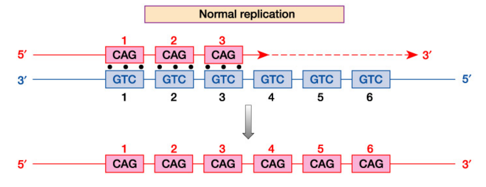
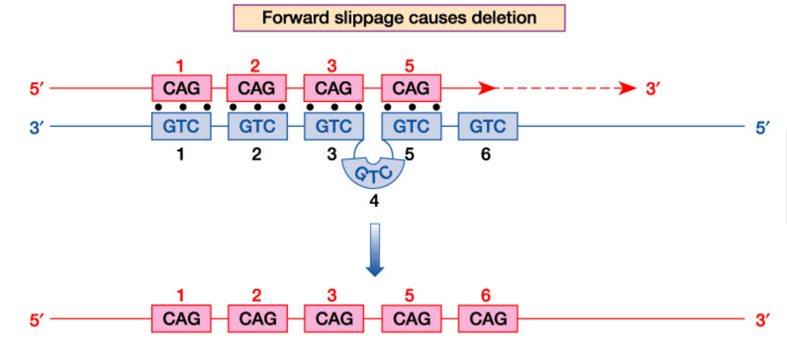
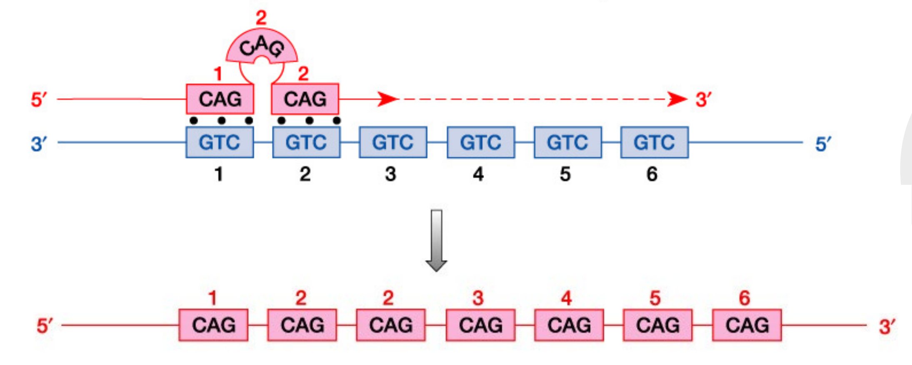
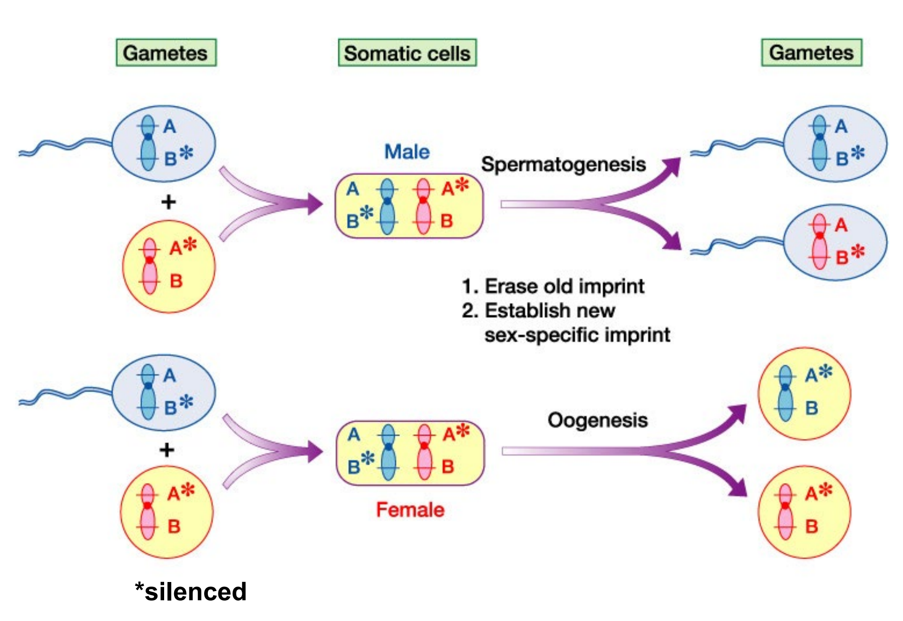
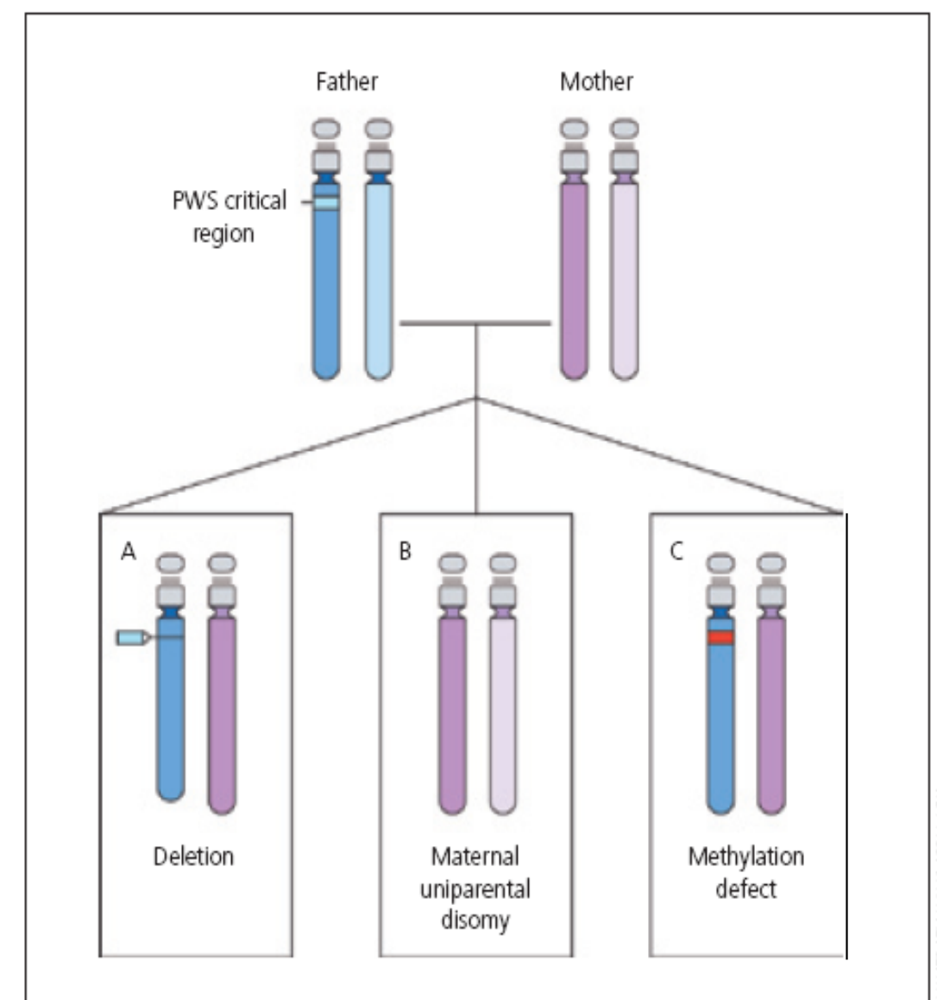

# Demo Case: Mitochondrial DNA notes

- Study Guide ID: `1014279`
- Deck ID: `1744239`
- Platform: `web`
- Generated images: **5**
- User identity: **Anonymized real user**

---

# Stable and Dynamic Mutations

## Mutation stability and repeat diseases
- **Stable mutations:** Most variants remain unchanged across generations.
  - **Example variant:** A paternal “G71R” variant remains “G71R” in the child.
- **Dynamic mutations:** Some variants are unstable during transmission.
  - **Repeat change:** Variants may expand or contract.
  - **Disease group:** Repeat diseases show dynamic mutations.
- **Repeat diseases:** Caused by nucleotide repeat tracts.
  - **Trinucleotide example:** CAGCAGCAG...
  - **Other repeat units:** Tetranucleotide, pentanucleotide, hexanucleotide.
- **Repeat variability:** Repeat diseases differ by several features.

| Feature | What varies |
|---|---|
| Repeat size | Number of repeated units |
| Repeat type | Nucleotide unit repeated |
| Repeat location | Where repeat lies in the gene/genome |
| Repeat instability | Tendency to expand or contract |
| Parent-of-origin effect | Transmission depends on parental origin |

- **Clinical association:** Seen in some neuromuscular and neurodegenerative diseases.
- **Replication problem:** Repeats can misalign during DNA replication.
  - **Timing:** May occur during meiosis or mitosis.
  - **Mechanism:** Strand slippage occurs while DNA strands align.
  - **Outcome:** Slippage may produce expansion or deletion in the gene.

## Slippage mechanisms and consequences
- **Normal replication:** Repeat units align correctly during DNA replication.
- **Forward slippage:** Misalignment can cause deletion of a repeat unit.
- **Backward slippage:** Misalignment can cause insertion and repeat expansion.
- **Expansion risk:** Expanded repeats may expand further in the next generation.
- **Gene dysfunction:** Expansion may impair gene function and cell physiology.
- **Anticipation:** Successive expansions can cause earlier onset or greater severity.

## Examples of trinucleotide repeat diseases
| Disease | Inheritance pattern | Gene | Repeat |
|---|---|---|---|
| Fragile X | X-linked | FMR1 | CGG |
| Huntington Chorea | Autosomal Dominant | Huntington | CAG |
| Myotonic Dystrophy | Autosomal Dominant | DMPK | CTG |
| Friedreich Ataxia | Autosomal Recessive | Frataxin | AAG |

| Disease | Mechanism of disease | Normal repeat size | Unstable intermediate | Affected |
|---|---|---:|---|---:|
| Fragile X | Excessive methylation reduces FMR1 expression | <60 | 60-200, usually not affected | >200 |
| Huntington Chorea | Toxic effect of polyglutamines | <36 | 29-35, usually not affected | >35 |
| Myotonic Dystrophy | Still undetermined | <30 | 50-80, usually mildly affected | 80-2000 |
| Friedreich Ataxia | Interferes with RNA processing, reducing frataxin expression | <34 | 36-100 | >100 |

# Genomic Imprinting

## Definition and epigenetic basis
- **Genomic imprinting:** Gene expression depends on parent of origin.
- **Allele-specific expression:** One inherited allele may be silent.
  - **SNRPN example:** Expressed only from the paternally inherited allele.
  - **Maternal allele:** Silent and produces no product.
- **Epigenetic mechanism:** Gene activity changes without altering DNA sequence.
- **Parent-origin marking:** Modification depends on whether allele is maternal or paternal.
- **CpG methylation:** Example of imprinting-related epigenetic modification.
  - **SNRPN methylation timing:** Occurs during ovum formation, not sperm formation.
  - **Chromatin effect:** Methylation makes chromatin less open.
  - **Transcription effect:** Less open chromatin prevents maternal allele transcription.

## Setting, maintenance, and resetting of imprints
- **Imprint setting:** Genomic imprinting is established during gametogenesis.
- **Long-term maintenance:** The imprint signal is maintained through later DNA replication.
- **Lifelong persistence:** Once imprinted, the signal remains set for life.
- **Resetting site:** Parent-of-origin imprint is erased only in gametogenesis cells.
- **Sex-specific reset:** Old imprints are erased, then new sex-specific imprints are established.

## Imprinting-related diseases and Prader-Willi syndrome
- **Disease mechanism:** Disease can occur when the functional allele is lost.
- **Imprinting disease examples:** Include Prader-Willi, Angelman, Beckwith-Wiedemann, and Russell-Silver syndromes.
- **Prader-Willi syndrome:** Rare genetic disorder.
- **Clinical features:** Includes intellectual disability, short stature, small hands, and small feet.
- **Feeding phenotype:** Initial feeding difficulty later becomes insatiable appetite.
  - **Obesity risk:** Appetite predisposes to morbid obesity and related consequences.
- **PWS molecular basis:** Loss of paternal allele function in chromosome 15 PWS critical region.

| Cause of PWS | Details | Approximate proportion |
|---|---|---:|
| Paternal deletion | Small deletion of PWS critical region on chromosome 15q11-13 | 70% |
| Maternal uniparental disomy | Two chromosome 15 copies inherited from mother | 30% |
| Imprinting centre defect | Defect in imprinting “switch” controlling on/off imprinting | <1% |

# Maternal Inheritance of the Mitochondrial Genome

## Mitochondrial genome structure and copy number
- **Genome location:** Mitochondrial genome is in a circular chromosome within mitochondria.
- **Gene content:** Each mitochondrial chromosome encodes 37 genes.

| Mitochondrial gene class | Number encoded |
|---|---:|
| Respiratory chain proteins | 13 |
| Ribosomal RNA genes | 2 |
| Transfer RNA genes | 22 |

- **Chromosome number:** Each mitochondrion contains a variable number of mitochondrial chromosomes.
- **Mitochondria per cell:** Cell mitochondrial number varies widely.
  - **Magnitude:** Differences may be in the thousands.

## Maternal transmission
- **Sperm mitochondria:** Sperm carries mitochondria in its tail.
- **Fertilization entry:** Sperm head enters the ovum, but the tail does not.
- **Ovum mtDNA load:** Each ovum contains more than 100,000 mitochondrial DNA copies.
- **Inheritance pattern:** Child inherits all mitochondrial DNA from the mother.