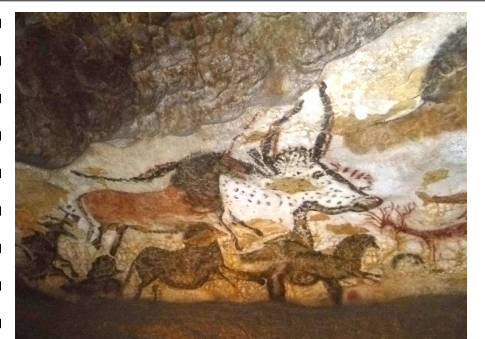
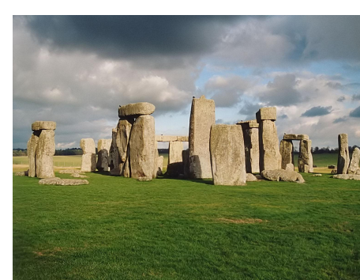
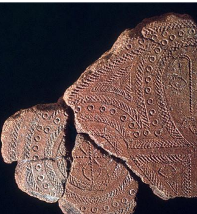

# Prehistoric Art Context

## Periods, Evidence, and Global Scope

| Area | High-yield details |
|---|---|
| Main stages | Paleolithic, Mesolithic, Neolithic |
| Paleolithic | Old Stone Age; hunter-gatherer context |
| Mesolithic | Middle Stone Age; nomadic groups; agriculture emerging |
| Neolithic | New Stone Age; settled communities; agriculture and animal domestication |
| Dating evidence | Carbon-14 dating and stratigraphic archaeology |
| Interpretation | Meanings inferred from survival strategies, tool use, culture, and technology |
| Core principle | Prehistoric art is contextual because written records do not exist |

- **Worldwide production:** Prehistoric art appeared across many regions before writing.
- **China:** Ritual objects appear in prehistoric traditions.
- **Saudi Arabia and Yemen:** Funerary steles are noted.
- **Japan, China, and Iran:** Ceramic technology is highlighted.
- **Lapita peoples:** Created pottery with incised geometric designs across the Pacific.
- **Europe:** Small human figurines and cave paintings are common.
- **Americas:** Dominant subjects include animals and sacred humans.
- **Human expression:** Artistic production existed before written language.

## Major Prehistoric Works and Materials

| Work | Location/Culture | Date | Material/Technique |
|---|---|---:|---|
| Apollo 11 | Namibia | c. 25,000–25,300 BCE | Charcoal on stone |
| Great Hall of the Bulls | Lascaux, France | c. 15,000–13,000 BCE | Rock painting |
| Camelid sacrum in shape of canine | Tequixquiac, central Mexico | c. 14,000–7,000 BCE | Bone |
| Running horned woman | Tassili n’Ajjer | c. 6,000–4,000 BCE | Pigment on rock |
| Beaker with ibex motifs | Susa, Iran | c. 4,200–3,500 BCE | Painted terra cotta |
| Anthropomorphic stele | Arabian Peninsula | 4th millennium BCE | Sandstone |
| Jade Cong | Liangzhu, China | c. 3,300–2,200 BCE | Carved jade |
| Stonehenge | Wiltshire, UK | c. 2,500–1,600 BCE | Sandstone |
| Ambum stone | Ambum Valley, Papua New Guinea | c. 1,500 BCE | Greywacke |
| Tlatilco female figurine | Central Mexico | c. 1,200–900 BCE | Ceramic |
| Terra cotta fragment | Lapita, Solomon Islands | c. 1,000 BCE | Incised terra cotta |

- **Rock painting:** Lascaux and Tassili n’Ajjer demonstrate pigment-based image-making.
- **Stone carving:** Jade Cong, Ambum stone, and steles show shaped durable materials.
- **Ceramic production:** Beaker, Tlatilco figurine, and Lapita fragment show fired clay traditions.
- **Ritual and funerary links:** Several works connect to burial, ritual, or sacred contexts.
- **Animal imagery:** Bulls, ibex, camelid/canine forms, and horned imagery recur.

# Key Concepts and Test Themes

## Vocabulary for Prehistoric Art Analysis

| Term | Revision focus |
|---|---|
| Art mobilier | Portable prehistoric art |
| Ritual | Repeated sacred or ceremonial action |
| Therianthrope | Figure combining human and animal traits |
| Ambiguous | Open to multiple interpretations |
| Superimposed | Placed over another image or layer |
| Shamanism | Spiritual practice linked to ritual specialists |
| Ethnography | Study of cultures and peoples |
| Sacrum | Bone associated with the pelvis |
| Biface | Tool worked on two faces |
| Vessel | Container form |
| Anthropomorphic | Human-like form |
| Stele | Upright stone monument |
| Cong | Chinese jade form |
| Menhir | Upright standing stone |
| Megalith | Large stone monument |
| Henge | Circular prehistoric earthwork or stone setting |
| Lintel | Horizontal stone spanning upright supports |
| Greywacke | Hard sandstone-like rock |
| Patina | Surface change from age or exposure |

| Art history term | Revision focus |
|---|---|
| Form | Physical appearance and structure |
| Function | Purpose or use |
| Content | Subject matter or meaning |
| Context | Cultural, historical, or physical setting |
| Elongated | Stretched proportions |
| Stylized | Simplified or patterned representation |
| Representational | Depicts recognizable subjects |
| Naturalistic | Closely resembles observed nature |
| Motif | Repeated design element |
| Linear | Based on line |
| Horizontal | Side-to-side orientation |
| Vertical | Up-and-down orientation |
| Cylindrical | Tube-like form |
| Negative space | Empty area around or within forms |
| Indigenous | Native to a region or people |
| Incised | Cut or carved into a surface |
| Frieze | Horizontal decorative band |
| Duality | Pairing or doubled meaning |
| Twisted perspective | Composite viewpoint of body parts |
| Composite view | Multiple viewpoints in one figure |
| Figurative art | Art representing figures or bodies |

- **Analysis categories:** Form, function, content, and context organize object interpretation.
- **Common materials:** Stone, bone, jade, sandstone, terra cotta, pigment, and greywacke recur.
- **Common processes:** Carving, painting, incision, rubbing, and firing appear across works.
- **Interpretive caution:** Prehistoric meaning depends on archaeological context and comparison.

## Stonehenge and Object Function Themes

| Object/theme | High-yield point |
|---|---|
| Stonehenge entrance | Heel Stone may align with summer and winter solstices |
| Stonehenge burial evidence | Bluestones may have honored or respectfully buried deceased ancestors |
| Construction phases | Site shifted eastward during final construction phase |
| Processional avenue | Created during final phase, not near its end |
| Jade Cong | Primary purpose linked to guiding the deceased into the afterlife |
| Terra cotta fragments | Could be shaped using pinching clay and manual shaping |
| Anthropomorphic stele | Found in Saudi Arabia during the same period as other ritual discoveries |
| Great Hall of the Bulls and Running horned woman | Both include superimposed imagery |
| Ambum stone | Greywacke object with animal-like form |

- **Burial association:** Several works connect to ancestors, deceased persons, or afterlife concerns.
- **Ritual landscapes:** Stonehenge combines megalithic architecture, alignment, and ceremonial movement.
- **Manual production:** Prehistoric makers used direct hand-forming and surface modification.
- **Shared visual strategy:** Superimposition appears in major painted rock contexts.
